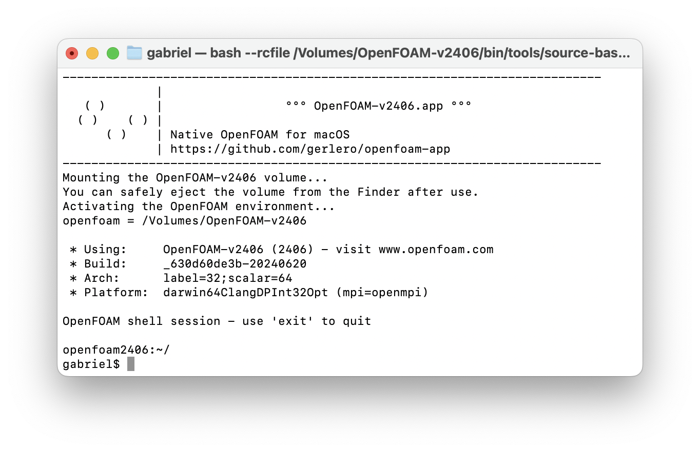

[](#)

# **OpenFOAM.app**: OpenFOAM for macOS

| 🎉  [OpenFOAM v2312 is now available!](#-install) |
| ---- |

**Native OpenFOAM as a Mac app**, with binaries compiled from the [OpenFOAM source code](https://develop.openfoam.com/Development/openfoam/-/blob/master/doc/Build.md). Intel and Apple silicon variants.

[](https://github.com/gerlero/openfoam-app/actions/workflows/ci.yml)
[](https://github.com/gerlero/openfoam-app/actions/workflows/release.yml)
[](https://github.com/gerlero/openfoam-app/releases)
[](https://github.com/gerlero/homebrew-openfoam)


## 🍏 Prerequisites

* An Apple silicon or Intel Mac
* A recent version of macOS
    * Apple silicon: macOS 14 Sonoma
    * Intel: macOS 12 Monterey or later
    * _Running an older version of macOS? [See here](#i-have-an-older-version-of-macos-and-cannot-upgrade-to-a-supported-version-what-can-i-do)_


## 📦 Install

* ✨ Get the latest OpenFOAM version with [Homebrew](https://brew.sh) (recommended):

    ```sh
    brew install --no-quarantine gerlero/openfoam/openfoam
    ```

* Or, choose the OpenFOAM version(s) you want:

    * **OpenFOAM v2312**

        * Install with [Homebrew](https://brew.sh):

            ```sh
            brew install --no-quarantine gerlero/openfoam/openfoam2312
            ```

        * Manual download: [⬇️ Apple silicon](https://github.com/gerlero/openfoam-app/releases/latest/download/openfoam2312-app-arm64.zip) | [⬇️ Intel](https://github.com/gerlero/openfoam-app/releases/latest/download/openfoam2312-app-x86_64.zip)

    * **OpenFOAM v2306**

        * Install with [Homebrew](https://brew.sh):

            ```sh
            brew install --no-quarantine gerlero/openfoam/openfoam2306
            ```

        * Manual download: [⬇️ Apple silicon](https://github.com/gerlero/openfoam-app/releases/latest/download/openfoam2306-app-arm64.zip) | [⬇️ Intel](https://github.com/gerlero/openfoam-app/releases/latest/download/openfoam2306-app-x86_64.zip)

* _Need an older version of OpenFOAM? [See here](#can-i-get-an-older-version-of-openfoam)_

## 🧑‍💻 Use

Just open the **OpenFOAM** app to start an OpenFOAM session in a new Terminal window.



That's it! When using OpenFOAM, a read-only volume will be loaded and visible in the Finder. The OpenFOAM installation lives inside this virtual disk. When you're not actively using OpenFOAM, it is safe to "eject" the volume from the Finder sidebar.

**💻 From the command line**: when installed with Homebrew, the app includes a terminal command that starts an OpenFOAM session:

```sh
openfoam
```

If you did not install with Homebrew, you can get the same by invoking the following command (replace the path and app name as needed):

```sh
/Applications/OpenFOAM-v2312.app/Contents/Resources/etc/openfoam
```


## 🙋 Q&A

### I also need ParaView. How can I get that?

Get the native macOS version of ParaView from the [official site](https://www.paraview.org/download/) or [install with Homebrew](https://formulae.brew.sh/cask/paraview) (prefer the latter if you'd like to use OpenFOAM's `paraFoam` command).

### Why do I see a dialog that says the app "cannot be opened because the developer cannot be verified"?

This message appears because the app is not notarized by Apple. You can tell macOS to allow the app to run by [right-clicking on the app in a Finder window and selecting Open from the context menu](https://docs.brew.sh/FAQ#why-cant-i-open-a-mac-app-from-an-unidentified-developer). You only need to do this for the first launch of the app.
   
If you're installing with Homebrew, the suggested ``--no-quarantine`` option does this for you on install.

### Can I compile and install my own (or third-party) solvers?

Yes. Just a few things to keep in mind:

* The OpenFOAM installation itself is not user-writable. This is very much intentional (and is similar with how it works with packaged OpenFOAM on Linux). The right way to install additional solvers and libraries is to place the binaries in `$FOAM_USER_APPBIN` and `$FOAM_USER_LIBBIN` respectively. See [here](https://github.com/gerlero/porousMicroTransport) for an example of a project that installs this way.

* The compiler used on macOS is Apple's Clang, which is not the same as the GCC compiler used by default on Linux. If your code was never tested with Clang before, some lines might require a little tweaking ([this is the most common fix that is needed](https://github.com/gerlero/openfoam-app/issues/87)) to be able to build across both compilers.

* The default macOS filesystem is case-insensitive, which differs from Linux. See below for what this means.

### What's the deal with case sensitivity?

[OpenFOAM is notably developed with a case-sensitive filesystem in mind](https://develop.openfoam.com/Development/openfoam/-/issues/1602). This is a non-issue on Linux systems, which conventionally use case-sensitive filesystems. In practice, a case-sensitive filesystem means that two different files named `phi` and `Phi` in the same directory can exist just fine. In contrast, a case-_insensitive_ filesystem, as is the default on macOS, will only allow one of those files to exist in the same folder.

This project gets around potential case-sensitivity issues by putting OpenFOAM itself inside a (read-only) disk image with its own case-sensitive filesystem, which is mounted as a virtual volume during use. This is enough to accommodate OpenFOAM, and for most purposes you can just use your regular filesystem for everything else (e.g. to store OpenFOAM cases).

However, there are a few circumstances where this is not sufficient (e.g. solvers/cases using case-sensitive field names). If you fall under one of these, consider [creating a case-sensitive disk image with the macOS Disk Utility](https://support.apple.com/en-gb/guide/disk-utility/dskutl11888/mac) for the case-sensitive stuff.

### Why do I get a dialog prompting me to install the "command line developer tools"?

You are attempting something that requires development tools (e.g. a compiler), and you do not have such tools installed yet. Just follow the steps to install the necessary tools from Apple and you should be good to go.

### I have an older version of macOS and cannot upgrade to a supported version. What can I do?

If you cannot upgrade to a newer macOS, you still have a few alternatives:

* **Try [installing the latest release](#-install) anyway.** The [required macOS versions](#-prerequisites) are those on which the latest release has been tested and is known to work. It is likely that the app will work too on some previous versions of macOS, but due to limited resources I cannot test with older OS versions

* Download an older release that was tested with your configuration:

    * Apple silicon — last release tested with macOS 13 Ventura: [**OpenFOAM.app** 1.10.2](https://github.com/gerlero/openfoam-app/releases/tag/v1.10.2) ([⬇️ OpenFOAM v2306](https://github.com/gerlero/openfoam-app/releases/download/v1.10.2/openfoam2306-app-standalone-arm64.zip), [⬇️ OpenFOAM v2212](https://github.com/gerlero/openfoam-app/releases/download/v1.10.2/openfoam2212-app-standalone-arm64.zip), [⬇️ OpenFOAM v2206](https://github.com/gerlero/openfoam-app/releases/download/v1.10.2/openfoam2206-app-standalone-arm64.zip), [⬇️ OpenFOAM v2112](https://github.com/gerlero/openfoam-app/releases/download/v1.10.2/openfoam2112-app-standalone-arm64.zip))

    * Apple silicon — last release tested with macOS 12 Monterey: [**OpenFOAM.app** 1.8.5](https://github.com/gerlero/openfoam-app/releases/tag/v1.8.5) ([⬇️ OpenFOAM v2206](https://github.com/gerlero/openfoam-app/releases/download/v1.8.5/openfoam2206-app-standalone-arm64.zip), [⬇️ OpenFOAM v2112](https://github.com/gerlero/openfoam-app/releases/download/v1.8.5/openfoam2112-app-standalone-arm64.zip))

    * Intel — last release tested with macOS 11 Big Sur: [**OpenFOAM.app** 1.11.1](https://github.com/gerlero/openfoam-app/releases/tag/v1.11.1) ([⬇️ OpenFOAM v2306](https://github.com/gerlero/openfoam-app/releases/download/v1.11.1/openfoam2306-app-x86_64.zip), [⬇️ OpenFOAM v2212](https://github.com/gerlero/openfoam-app/releases/download/v1.11.1/openfoam2212-app-x86_64.zip))

    * Intel — last release tested with macOS 10.15 Catalina: [**OpenFOAM.app** 1.8.5](https://github.com/gerlero/openfoam-app/releases/tag/v1.8.5) ([⬇️ OpenFOAM v2206](https://github.com/gerlero/openfoam-app/releases/download/v1.8.5/openfoam2206-app-standalone-x86_64.zip), [⬇️ OpenFOAM v2112](https://github.com/gerlero/openfoam-app/releases/download/v1.8.5/openfoam2112-app-standalone-x86_64.zip))

* Or, you can try [building the app from source](#-building-from-source) on the system where you'll be using it

Whatever alternative you choose, please avoid opening an issue if something doesn't work as expected when running an older version of macOS.

### Can I get an older version of OpenFOAM?

If you need an older version of OpenFOAM, you can:

* Use an older release of **OpenFOAM.app** (note that these apps are no longer updated):

    * [**OpenFOAM-v2212.app** 1.11.1](https://github.com/gerlero/openfoam-app/releases/tag/v1.11.1)
        * Homebrew: `brew install --no-quarantine gerlero/openfoam/openfoam2212`
        * [⬇️ Apple silicon](https://github.com/gerlero/openfoam-app/releases/download/v1.11.1/openfoam2212-app-arm64.zip): tested with macOS 14 Sonoma
        * [⬇️ Intel](https://github.com/gerlero/openfoam-app/releases/download/v1.11.1/openfoam2212-app-x86_64.zip): tested with macOS 11 Big Sur through macOS 13 Ventura

    * [**OpenFOAM-v2206.app** 1.10.2](https://github.com/gerlero/openfoam-app/releases/tag/v1.10.2)
        * Homebrew: `brew install --no-quarantine gerlero/openfoam/openfoam2206`
        * [⬇️ Apple silicon](https://github.com/gerlero/openfoam-app/releases/download/v1.10.2/openfoam2206-app-standalone-arm64.zip): tested with macOS 13 Ventura and macOS 14 Sonoma
        * [⬇️ Intel](https://github.com/gerlero/openfoam-app/releases/download/v1.10.2/openfoam2206-app-standalone-x86_64.zip): tested with macOS 11 Big Sur through macOS 13 Ventura

    * [**OpenFOAM-v2112.app** 1.10.2](https://github.com/gerlero/openfoam-app/releases/tag/v1.10.2)
        * Homebrew: `brew install --no-quarantine gerlero/openfoam/openfoam2112`
        * [⬇️ Apple silicon](https://github.com/gerlero/openfoam-app/releases/download/v1.10.2/openfoam2112-app-standalone-arm64.zip): tested with macOS 13 Ventura and macOS 14 Sonoma
        * [⬇️ Intel](https://github.com/gerlero/openfoam-app/releases/download/v1.10.2/openfoam2112-app-standalone-x86_64.zip): tested with macOS 11 Big Sur through macOS 13 Ventura

* Or, you can try your luck at [building the app from source](#-building-from-source) with the version of OpenFOAM you need

Please avoid opening an issue if something doesn't work as expected when using an older version of OpenFOAM.

### Can I get an app for a version from the OpenFOAM Foundation ([openfoam.org](openfoam.org), e.g. OpenFOAM 10)?

No. The OpenFOAM Foundation's distribution [does not support native compilation on macOS](https://github.com/gerlero/openfoam-app/issues/14#issuecomment-1049843002).

### How do I uninstall the app?

If you installed with Homebrew, uninstall with ``brew uninstall``. If you downloaded manually, delete the app.


## 🔨 Building from source

If you need to, building an **OpenFOAM.app** entirely from source is easy as cloning this repo and running `make`, i.e.:

```sh
git clone https://github.com/gerlero/openfoam-app.git
cd openfoam-app
make
```

The Xcode Command Line Tools are required. See the available configuration variables and alternative targets for `make` in the [`Makefile`](Makefile). Note that the compilation of OpenFOAM and the necessary dependencies from source may take a while.


## 📄 Legal notices

### Disclaimer

This offering is not approved or endorsed by OpenCFD Limited, producer and distributor of the OpenFOAM software via www.openfoam.com, and owner of the OPENFOAM®  and OpenCFD® trade marks.

### Trademark acknowledgement

OPENFOAM® is a registered trade mark of OpenCFD Limited, producer and distributor of the OpenFOAM software via www.openfoam.com.
