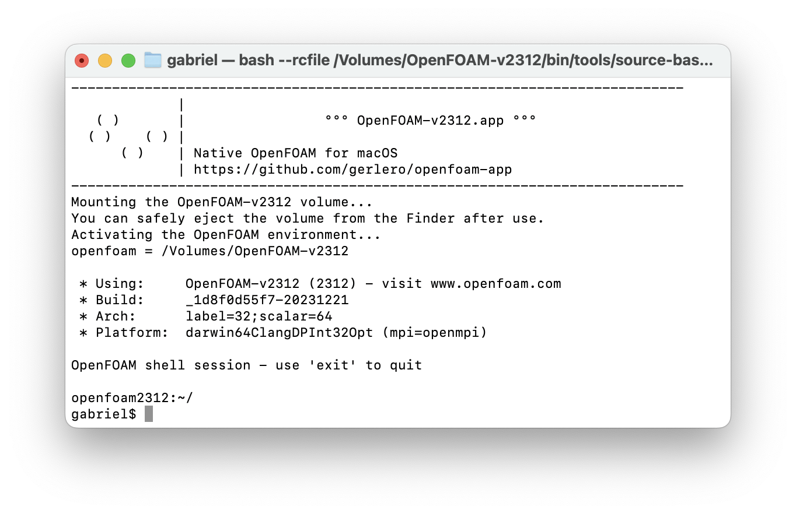

[](#)

# **OpenFOAM.app**: OpenFOAM for macOS

**Native OpenFOAM as a Mac app**, with binaries compiled from the [OpenFOAM source code](https://develop.openfoam.com/Development/openfoam/-/blob/master/doc/Build.md). Intel and Apple silicon variants.

[](https://github.com/gerlero/openfoam-app/actions/workflows/ci.yml) [](https://github.com/gerlero/openfoam-app/actions/workflows/release.yml) [](https://github.com/gerlero/openfoam-app/releases) [](https://github.com/gerlero/homebrew-openfoam)


## 🍏 Prerequisites

* An Intel or Apple silicon Mac
* A recent version of macOS
    * Intel: macOS 10.15 or later (older macOS versions might work, but are not tested)
    * Apple silicon: macOS 12 or later (macOS 11 should also work, but is not tested)


## 📦 Install

* **OpenFOAM v2206**

    * Using [Homebrew](https://brew.sh):

        ```sh
        brew install --no-quarantine gerlero/openfoam/openfoam2206
        ```

    * Manual download (standalone app):

        * ⬇️ [Intel (`x86_64`)](https://github.com/gerlero/openfoam-app/releases/latest/download/openfoam2206-app-standalone-x86_64.zip) (latest release)

        * ⬇️ [Apple silicon (`arm64`)](https://github.com/gerlero/openfoam-app/releases/latest/download/openfoam2206-app-standalone-arm64.zip) (latest release)

        * Or, choose the `standalone` release you want from the [Releases page](https://github.com/gerlero/openfoam-app/releases)

* **OpenFOAM v2112**

    * Using [Homebrew](https://brew.sh):

        ```sh
        brew install --no-quarantine gerlero/openfoam/openfoam2112
        ```

    * Manual download (standalone app):

        * ⬇️ [Intel (`x86_64`)](https://github.com/gerlero/openfoam-app/releases/latest/download/openfoam2112-app-standalone-x86_64.zip) (latest release)

        * ⬇️ [Apple silicon (`arm64`)](https://github.com/gerlero/openfoam-app/releases/latest/download/openfoam2112-app-standalone-arm64.zip) (latest release)

        * Or, choose the `standalone` release you want from the [Releases page](https://github.com/gerlero/openfoam-app/releases)


## 🧑‍💻 Use

Just open the **OpenFOAM** app to start an OpenFOAM session in a new Terminal window.



That's it! When using OpenFOAM, a read-only volume will be loaded and visible in the Finder. The OpenFOAM installation lives inside this virtual disk. When you're not actively using OpenFOAM, it is safe to "eject" the volume from the Finder sidebar.

**💻 From the command line**: when installed with Homebrew, the app includes a terminal command that starts an OpenFOAM session. For example, the **OpenFOAM-v2206** app provides the command:

```sh
openfoam2206
```

If you did not install with Homebrew, you can get the same by invoking the following command (replace the path and app name as needed):

```sh
/Applications/OpenFOAM-v2206.app/Contents/Resources/etc/openfoam
```


## 🙋 Q&A

### I also need ParaView. Where/how do I get it?

Get the native macOS version of ParaView from the [official site](https://www.paraview.org/download/) or [install with Homebrew](https://formulae.brew.sh/cask/paraview) (prefer the latter if you'd like to use OpenFOAM's `paraFoam` command).

### Why do I see a dialog that says the app "cannot be opened because the developer cannot be verified"?

This message appears because the app is not notarized by Apple. You can tell macOS to allow the app to run by [right-clicking on the app in a Finder window and selecting Open from the context menu](https://docs.brew.sh/FAQ#why-cant-i-open-a-mac-app-from-an-unidentified-developer). You only need to do this for the first launch of the app.
   
If you're installing with Homebrew, the suggested ``--no-quarantine`` option does this for you on install.

### Can I compile and install my own (or third-party) solvers?

Yes. Just a few things to keep in mind:

* The OpenFOAM installation itself is not user-writable. This is very much intentional (and is similar with how it works with packaged OpenFOAM on Linux). The right way to install additional solvers and libraries is to place the binaries in `$FOAM_USER_APPBIN` and `$FOAM_USER_LIBBIN` respectively. See [here](https://github.com/gerlero/porousMicroTransport) for an example of a project that installs this way.

* The compiler used on macOS is Apple's Clang, which is not the same as the GCC compiler used by default on Linux. If your code was never tested with Clang before, some lines might require a little tweaking ([this is the most common fix that is needed](https://github.com/gerlero/openfoam-app/issues/87)) to be able to build across both compilers.

* The default macOS filesystem is case-insensitive, which differs from Linux. See below for what this means.

### What's the deal with case sensitivity?

[OpenFOAM is notably developed with a case-sensitive filesystem in mind](https://develop.openfoam.com/Development/openfoam/-/issues/1602). This is a non-issue on Linux systems, which conventionally use case-sensitive filesystems. In practice, a case-sensitive filesystem means that two different files named `phi` and `Phi` in the same directory can exist just fine. In contrast, a case-_insensitive_ filesystem, as is the default on macOS, will only allow one of those files to exist in the same folder.

This project gets around potential case-sensitivity issues by putting OpenFOAM itself inside a (read-only) disk image with its own case-sensitive filesystem, which is mounted as a virtual volume during use. This is enough to accommodate OpenFOAM, and for most purposes you can just use your regular filesystem for everything else (e.g. to store OpenFOAM cases).

However, there are a few circumstances where this is not sufficient (e.g. solvers/cases using case-sensitive field names). If you fall under one of these, consider [creating a case-sensitive disk image with the macOS Disk Utility](https://support.apple.com/en-gb/guide/disk-utility/dskutl11888/mac) for the case-sensitive stuff.

### Why do I get a dialog prompting me to install the "command line developer tools"?

You are attempting something that requires development tools (e.g. a compiler), and you do not have such tools installed yet. Just follow the steps to install the necessary tools from Apple and you should be good to go.

### Can I get an app for a version from the OpenFOAM Foundation ([openfoam.org](openfoam.org), e.g. OpenFOAM 10)?

No. The OpenFOAM Foundation's distribution [does not support native compilation on macOS](https://github.com/gerlero/openfoam-app/issues/14#issuecomment-1049843002).

### How do I uninstall the app?

If you installed with Homebrew, uninstall with ``brew uninstall``. After that, you can run [```brew autoremove```](https://docs.brew.sh/Manpage#autoremove---dry-run) to also remove installed dependencies that are no longer required.

If you installed manually, just delete the app (for the manual install, the apps are fully self-contained).


## 🔨 Building from source

If you need to, building an **OpenFOAM.app** entirely from source is easy as cloning this repo and running `make`, i.e.:

```sh
git clone https://github.com/gerlero/openfoam-app.git
cd openfoam-app
make
```

The Xcode Command Line Tools are required. See the available configuration variables and alternative targets for `make` in the [`Makefile`](Makefile). Note that the compilation of OpenFOAM and the necessary dependencies from source may take a while.


## 📄 Legal notices

### Disclaimer

This offering is not approved or endorsed by OpenCFD Limited, producer and distributor of the OpenFOAM software via www.openfoam.com, and owner of the OPENFOAM®  and OpenCFD® trade marks.

### Trademark acknowledgement

OPENFOAM® is a registered trade mark of OpenCFD Limited, producer and distributor of the OpenFOAM software via www.openfoam.com.
